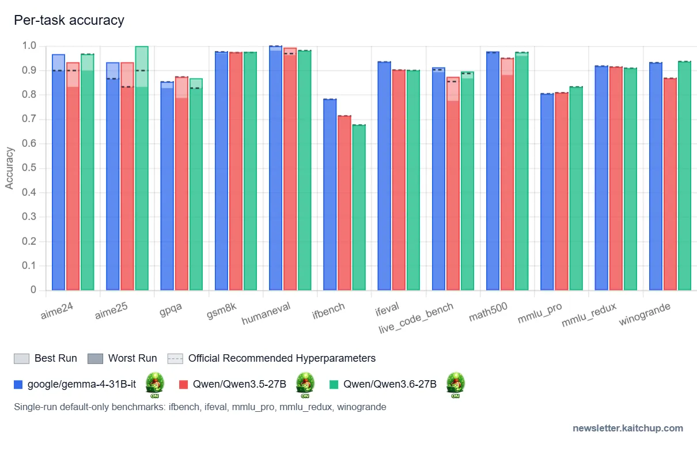
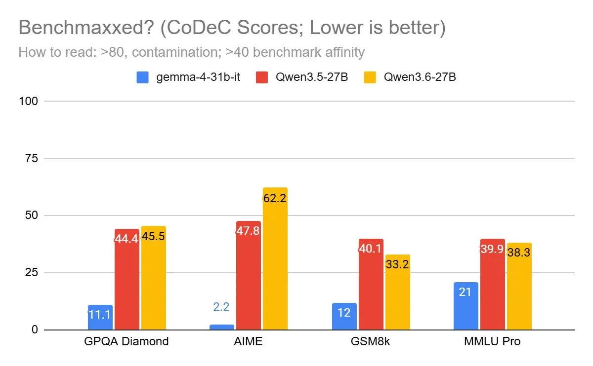
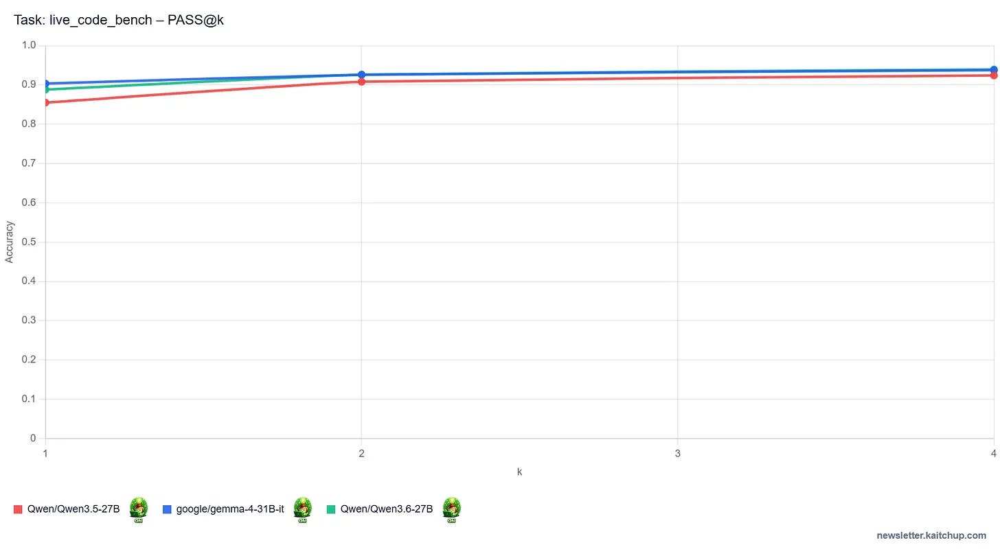

# Qwen3.6 27B vs Qwen3.5 27B vs Gemma 4 31B — External Benchmark Notes

**Status:** Research note (external source summary)
**Captured:** 2026-05-11
**Source:** Benjamin Marie, *The Kaitchup — AI on a Budget*, "Qwen3.6 27B vs Qwen3.5 27B vs Gemma 4 31B: Accuracy, Latency, Memory, and Token Efficiency Tested," 2026-05-05 (paid Substack — only the accuracy section is in the free preview captured here).
**Local copy:** `~/Downloads/q-vs-g.pdf` (free-tier export, 7 pages)
**Relates to bd issues:** `benchmarks-<CAMPAIGN>` (Qwen3.6-27B thinking-mode), `benchmarks-<CAMPAIGN>` (Gemma-4-31B-IT-NVFP4)

This note summarises the publicly visible portion of Marie's head-to-head between Qwen3.6-27B, Qwen3.5-27B, and Gemma-4-31B-IT. The latency, memory, and token-efficiency sections are paywalled and not reproduced here.

---

## 1. Why this matters for `benchmarks-rlp`

Our rental-pool quality sweep (`<CAMPAIGN>-.11`) covers exactly this model class on Blackwell/Hopper, including:

- `<CAMPAIGN>` — Qwen3.6-27B-Dense (FP8 + NVFP4 variants; recently fixed thinking-mode / EOS / KV-dtype regressions, see c941d958)
- `<CAMPAIGN>` — Gemma-4-31B-IT-NVFP4 (cuda-toolkit-13-0 install fix landed c1042ab1)

Marie's setup is non-agentic, no tool calls, single-shot — the same regime our `run-pool-b` BigCodeBench-Hard / IFEval / MMLU-Pro runs target. His results are therefore a useful external sanity-check for the numbers we'll publish, especially the per-task variance bars (he reports Best vs Worst over multiple seeds).

## 2. Headline finding

Qwen3.6 is **only marginally better than Qwen3.5 on average** in non-agentic single-shot eval, and **still trails Gemma-4-31B-IT** on this task class.

Marie's framing: "Qwen3 appears to have been fine-tuned specifically for stronger agentic performance" — the lift Qwen reports for 3.6 doesn't show up cleanly when you strip out tools.

## 3. Per-task accuracy

Legend: blue = Gemma-4-31B-IT, red = Qwen3.5-27B, green = Qwen3.6-27B. Solid bar = best run, faint bar = worst run, dotted = official recommended hyperparameters. Single-run-only benchmarks: ifbench, ifeval, mmlu_pro, mmlu_redux, winogrande.

Where Qwen3.6 wins decisively:

- **AIME24 / AIME25** — Qwen3.6 ≫ Qwen3.5 ≈ Gemma 4 (largest gap in the chart)
- **Math500** — Qwen3.6 > Qwen3.5
- **MMLU-Pro** — Qwen3.6 > both

Where Gemma 4 still leads:

- **LiveCodeBench (pass@1)** — Gemma 4 > Qwen3.6 > Qwen3.5
- **HumanEval, GSM8K** — all three roughly tied near the top

Surprising regressions for Qwen3.6:

- **IFBench** — Qwen3.6 significantly worse than Qwen3.5 at instruction following
- **GPQA Diamond** — Qwen3.6 worse than Qwen3.5, contradicting Qwen's own +2.3-point claim. Marie cross-checked against Artificial Analysis and saw the same direction. He attributes the discrepancy to hyperparameters / benchmark version / post-processing differences in the official numbers.

> "Benchmark scores published by different groups are not directly comparable" — useful caveat to carry into our own publication.

## 4. CoDeC contamination scoring

Marie ran CoDeC (his own contamination-style benchmark-affinity probe) to interrogate the AIME gap. Scale: >40 = "benchmark affinity," >80 = "contamination."

| Benchmark    | Gemma-4-31B-IT | Qwen3.5-27B | Qwen3.6-27B |
|--------------|----------------|-------------|-------------|
| GPQA Diamond | 11.1           | 44.4        | 45.5        |
| AIME         |  2.2           | 47.8        | **62.2**    |
| GSM8K        | 12             | 40.1        | 33.2        |
| MMLU Pro     | 21             | 39.9        | 38.3        |

Qwen3.6's 62.2 on AIME is "very rare" per Marie and explains much of the AIME jump. Gemma-4-31B-IT looks essentially un-trained on AIME-style data by comparison.

**Implication for us:** when we report Qwen3.6 AIME numbers from `run-pool-b`, we should flag the contamination signal rather than treating it as raw capability uplift.

## 5. LiveCodeBench pass@k

At pass@1 Gemma-4-31B-IT leads (~0.90), Qwen3.6 second (~0.89), Qwen3.5 trailing (~0.86). By pass@4 all three converge near 0.93-0.94, with Gemma still nominally on top.

Marie's economic argument: even though pass@k closes the accuracy gap, Qwen3.6's higher per-token cost (presumably from thinking + longer outputs — full numbers paywalled) means **Gemma-4-31B-IT remains cheaper for the same coding accuracy target**.

This is exactly the kind of accuracy-per-dollar plot we want to produce for our own rental-pool campaign.

## 6. What's behind the paywall

We do **not** have data from the second half of the article. Topics announced but not visible in the free export:

- Token efficiency (tokens-per-correct-answer, presumably split by thinking on/off)
- Latency comparisons
- Memory consumption
- Recommendation / cost trade-off

If we want the paywalled numbers we'd need a Kaitchup paid subscription. Estimated value: high — token-efficiency and latency are the dimensions our rental-pool sweep is *least* equipped to compare against without an external reference point.

## 7. Hardware Marie used

Compute sponsored by **Verda** (European GPU cloud) on B200 and RTX Pro 6000 (Blackwell). Worth noting because:

- Our `<CAMPAIGN>` campaign also runs on RTX Pro 6000 (SM120) under Runcrate — see the `runcrate-rtx-pro-6000-sm120-nvfp4-spike-pass` memory.
- B200 numbers from Marie may be directly comparable to whatever we end up running on Lambda B200 instances if that path opens up.

## 8. Action items

None blocking. Suggested follow-ups when we publish our own <CAMPAIGN> / <CAMPAIGN> results:

1. Include the CoDeC caveat when reporting Qwen3.6 AIME — note the external-source contamination signal.
2. Cross-reference Marie's pass@k LiveCodeBench plot if our pass@1 numbers come out in the same ordering (Gemma > Qwen3.6 > Qwen3.5).
3. Consider whether spending on a one-month Kaitchup subscription to import his latency/token-efficiency numbers is cheaper than running our own latency campaign on B200.

---

*Charts in `assets/q-vs-g/` extracted from the source PDF via `pdfimages -png`. Original PDF retained at `~/Downloads/q-vs-g.pdf` (not committed — paywalled material).*
